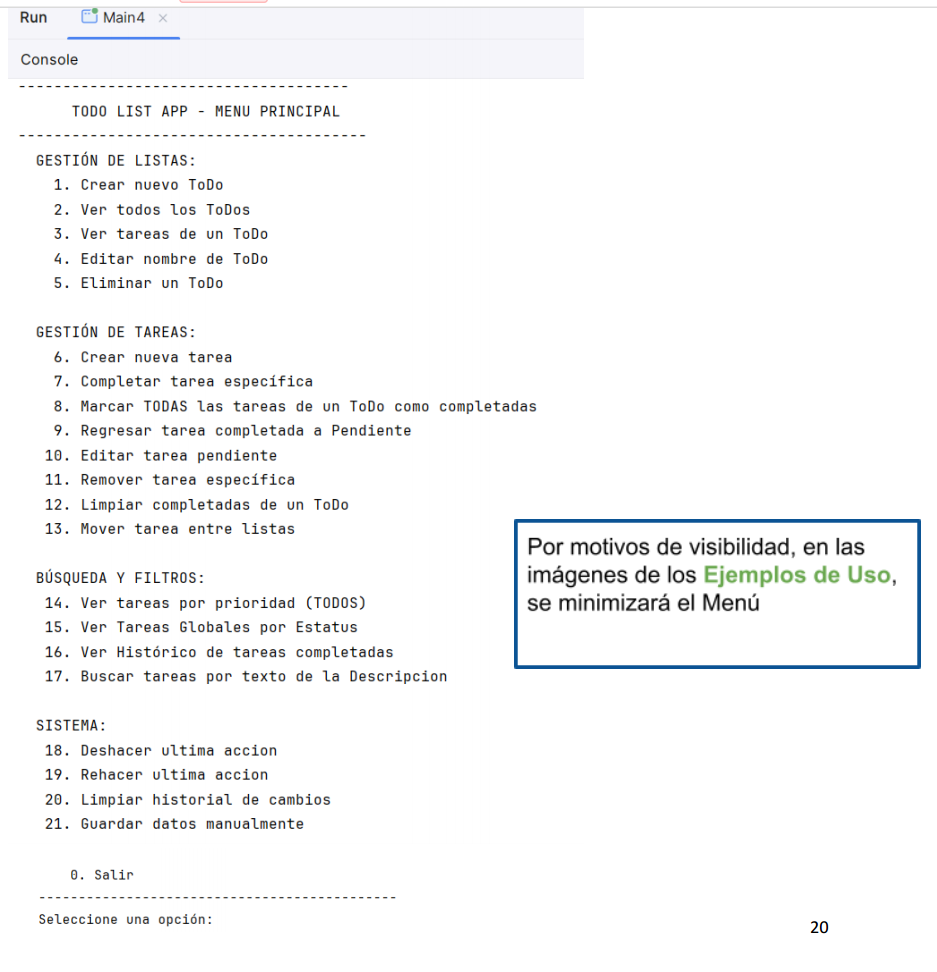
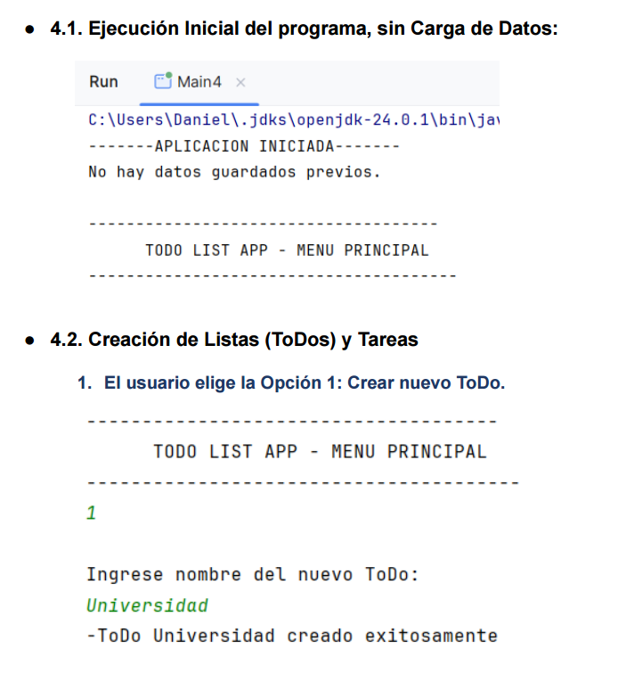
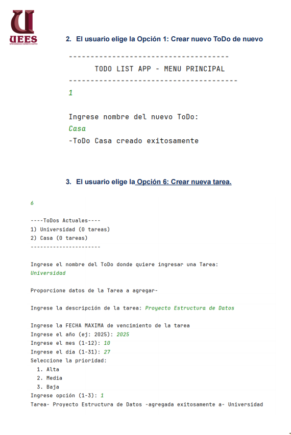
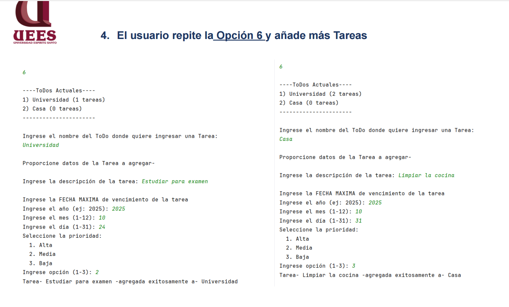
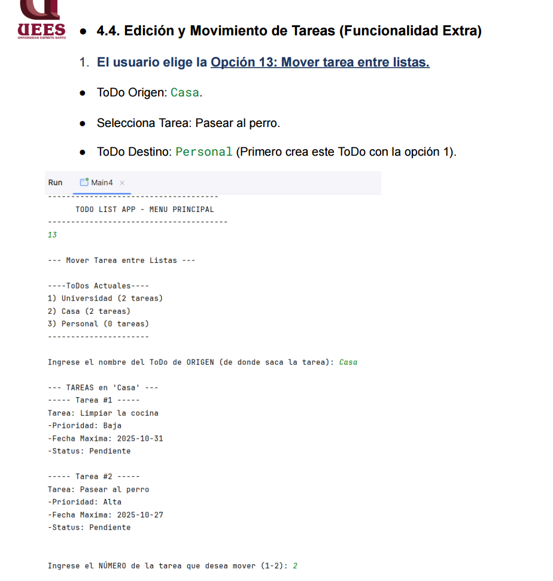
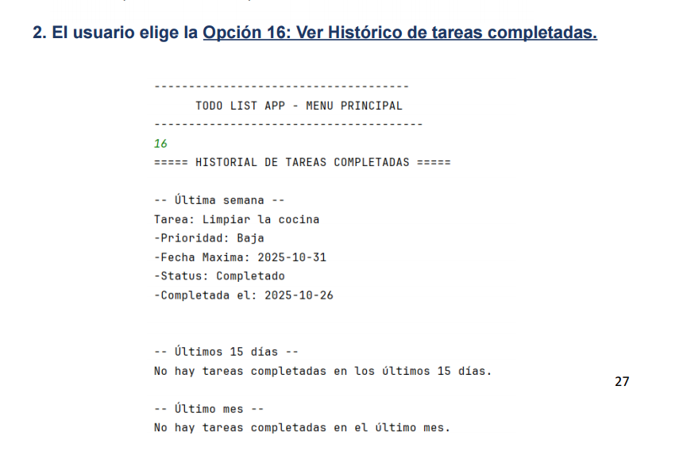
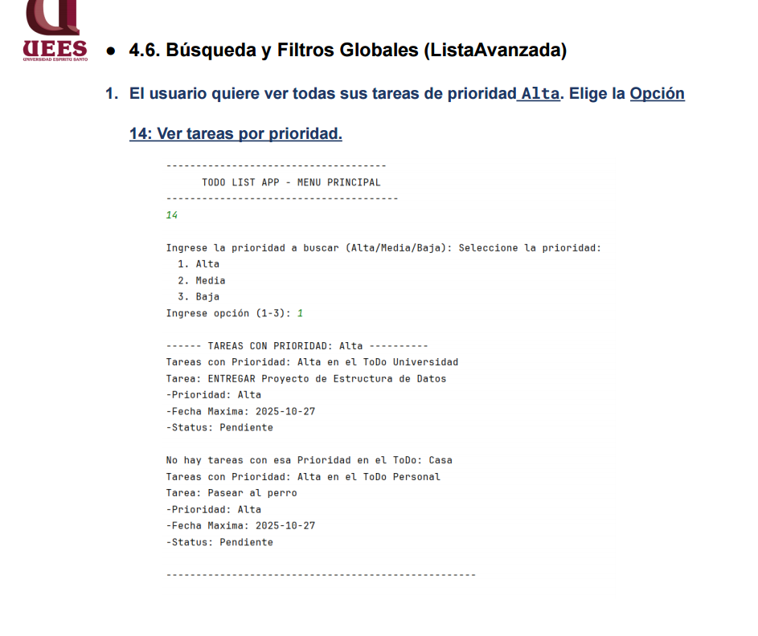
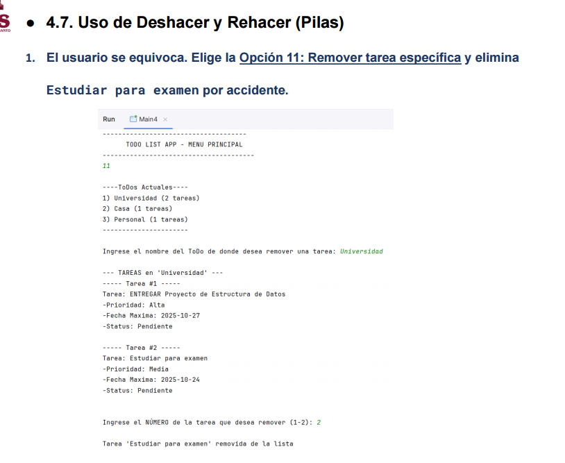
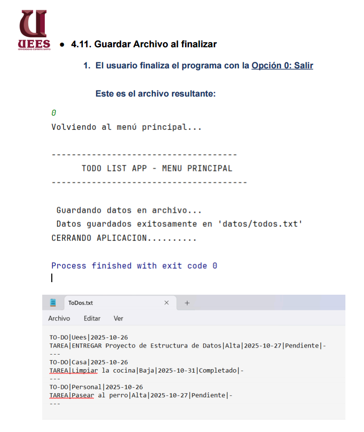

# To-Do List App · Gestor de Tareas en Java

**Materia:** Estructura de Datos | **Periodo:** 2025-2 | **Estado:** Completado

Aplicación de consola en **Java** para la gestión de tareas. Permite organizar las
actividades diarias creando varias listas (**ToDos**) y, dentro de cada una, tareas con
descripción, **prioridad** (Alta / Media / Baja) y fecha límite. El programa ofrece **22
opciones** (21 funciones + salir) para crear, editar, mover, completar, buscar y filtrar
tareas, con **deshacer/rehacer**, **historial de completadas** y **persistencia en
archivo** (los datos se conservan entre ejecuciones). Desarrollado para la materia de
Estructura de Datos de la Universidad Espíritu Santo (UEES), Guayaquil – Ecuador.

## Equipo de trabajo

- [Daniel Andrés Vaca Velástegui](https://github.com/DanielV-13)
- [Xavier Andrés Cárdenas Pesántez](https://github.com/Xavier2806)

## Capturas / Demo

> Aplicación de consola (sin demo en línea). Las capturas reflejan la ejecución local.

**Menú principal — las 21 funciones del programa**



**Ejecución inicial (sin datos previos) e inicio de creación de listas**



**Creación de listas (ToDos) y de una tarea con prioridad y fecha**



**Agregando más tareas a las listas**



**Mover una tarea entre listas (Opción 13)**



**Histórico de tareas completadas: última semana, 15 días y último mes (Opción 16)**



**Búsqueda y filtros globales: ver tareas por prioridad (Opción 14)**



**Deshacer y rehacer con pilas: remover una tarea por error (Opción 11)**



**Guardado automático al salir y archivo de persistencia `datos/todos.txt` (Opción 0)**



## Funcionalidad

Las 22 opciones del menú (todas implementadas) viven en la clase `App`:

### Gestión de Listas (ToDos)

- [x] **1. crearNuevoToDo()** — Crea una nueva lista de tareas.
- [x] **2. verToDos()** — Muestra todas las listas y cuántas tareas tiene cada una.
- [x] **3. verTareasDeToDo()** — Ver las tareas de una lista (pendientes ordenadas por prioridad + completadas).
- [x] **4. editarNombreToDo()** — Cambiar el nombre de una lista. *(Extra)*
- [x] **5. eliminarToDo()** — Eliminar una lista completa con todas sus tareas. *(Extra)*

### Gestión de Tareas

- [x] **6. crearTarea()** — Crear una tarea con descripción, prioridad y fecha máxima, en el ToDo elegido.
- [x] **7. completarTareaEspecifica()** — Marcar una tarea como completada.
- [x] **8. marcarTodoCompletoEnToDo()** — Marcar todas las tareas de una lista como completadas.
- [x] **9. regresarTareaAPendiente()** — Devolver una tarea completada por error al estado “pendiente”. *(Extra)*
- [x] **10. editarTareaPendiente()** — Editar descripción, fecha o prioridad de una tarea. *(Extra)*
- [x] **11. removerTarea()** — Eliminar una tarea específica de una lista. *(Extra)*
- [x] **12. limpiarCompletadasDeToDo()** — Borrar permanentemente las tareas completadas de una lista.
- [x] **13. moverTareaEntreListas()** — Mover una tarea de una lista a otra. *(Extra)*

### Búsqueda y Filtros

- [x] **14. verTareasPorPrioridad()** — Ver todas las tareas de la app con una prioridad dada (alta/media/baja).
- [x] **15. mostrarMenuFiltroStatus()** — Filtrar globalmente por pendientes o completadas. *(Extra)*
- [x] **16. Ver histórico de completadas** — Tareas completadas en la última semana, últimos 15 días y último mes.
- [x] **17. buscarTareasPorTexto()** — Buscar tareas que contengan un texto en su descripción.

### Sistema (Historial y Persistencia)

- [x] **18. deshacer()** — Deshace la última acción realizada (crear, editar, mover, etc.).
- [x] **19. rehacer()** — Rehace una acción previamente deshecha.
- [x] **20. limpiarHistorial()** — Vacía el historial de cambios almacenado.
- [x] **21. guardarDatos()** — Guarda manualmente el estado actual en `datos/todos.txt`.
- [x] **0. Salir** — Guarda automáticamente los datos y cierra la aplicación.

> Historial de cambios: [ver commits](https://github.com/DanielV-13/PROYECTO-TO-DO-APP-CARDENAS-VACA/commits/master)

## Estructuras de Datos utilizadas

- **`LinkedList` (Lista enlazada):** guarda la lista de ToDos, las tareas de cada ToDo y el
  histórico de completadas. Se eligió sobre `ArrayList` por las frecuentes inserciones y
  eliminaciones y el uso de `ListIterator`, logrando operaciones O(1) en la mayoría de casos.
- **`Stack` (Pila):** en la clase `Historial`, implementa **Deshacer/Rehacer** guardando
  estados del `LinkedList<ToDo>`. Su naturaleza LIFO es ideal para revertir la última acción.
- **`PriorityQueue` (Cola de prioridad):** en `ToDo.verPendientes()`, ordena automáticamente
  las tareas por prioridad (Alta → Media → Baja) usando `ComparatorPrioridadOrden` y `poll()`.
- **`Comparator` + Genéricos `<E>`:** la clase genérica `ListaAvanzada<E>` usa comparadores
  (`ComparatorPrioridad`, `ComparatorStatus`, etc.) para un único método de búsqueda flexible
  y reutilizable.

## Tecnologías

`Java (JDK 24)` | `Java Collections: LinkedList · Stack · PriorityQueue` | `Comparator / Generics` | `Persistencia en archivo .txt` | `IntelliJ IDEA` | `Git / GitHub`

## Ejecución

Requisitos previos: **JDK instalado** (`java -version` para verificar). Opcionalmente
**IntelliJ IDEA**.

**Opción A — IntelliJ IDEA (recomendada)**

1. Abre la carpeta del proyecto en IntelliJ.
2. Ejecuta la clase `Main4` (contiene el método `main`).

**Opción B — Consola**

```bash
# 1. Clonar el repositorio
git clone https://github.com/DanielV-13/PROYECTO-TO-DO-APP-CARDENAS-VACA.git
cd PROYECTO-TO-DO-APP-CARDENAS-VACA

# 2. Compilar las clases en la carpeta out/
javac -d out src/*.java

# 3. Ejecutar
java -cp out Main4
```

Los datos de las tareas se guardan en `datos/todos.txt` y se recargan automáticamente la
próxima vez que abras la aplicación.

## Métricas de Progreso

| Indicador | Valor |
|-----------|-------|
| Commits totales | 2 |
| Issues/PRs fusionados | 0 / 0 |
| Cobertura de pruebas | N/A |
| Última actualización | 2025-10-27 |

## Reflexión y Aprendizajes

- **Habilidades desarrolladas:** implementación práctica de estructuras de datos lineales y
  no lineales en Java (listas enlazadas, pilas y colas de prioridad), diseño de clases con
  comparadores y tipos genéricos, y persistencia de datos en archivos.
- **Qué funcionó bien:** la `PriorityQueue` resolvió de forma natural el orden de las tareas
  por urgencia; las pilas (`Stack`) permitieron un Deshacer/Rehacer limpio; y la separación en
  clases (`App`, `ToDo`, `Tarea`, `Historial`, `HistorialCompletadas`, `ListaAvanzada`) mantuvo
  el código ordenado y fácil de extender.
- **Qué se podría mejorar:** agregar una interfaz gráfica (GUI) en lugar de la consola,
  implementar `buscarTareaPorFecha()`, reemplazar el archivo de texto por una base de datos e
  incorporar pruebas automatizadas.
- **Conceptos clave aplicados de la materia:** listas enlazadas (`LinkedList`), pilas (`Stack`),
  colas de prioridad (`PriorityQueue`), comparadores (`Comparator`), tipos genéricos (`<E>` /
  TDA) y persistencia de objetos. Como funcionalidad extra no requerida, se añadió el sistema
  de Deshacer/Rehacer, que aporta escalabilidad al proyecto.
